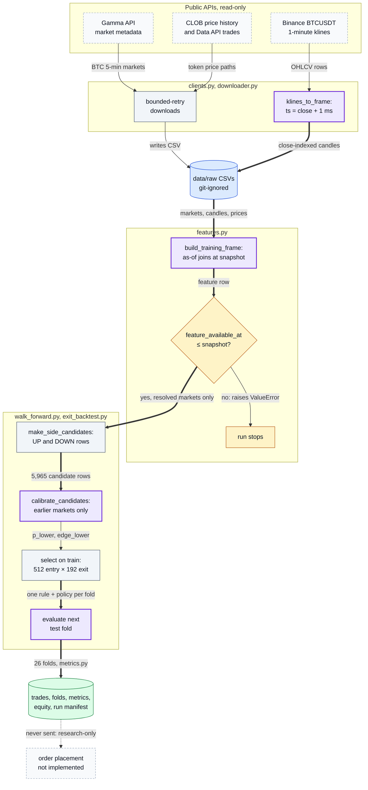
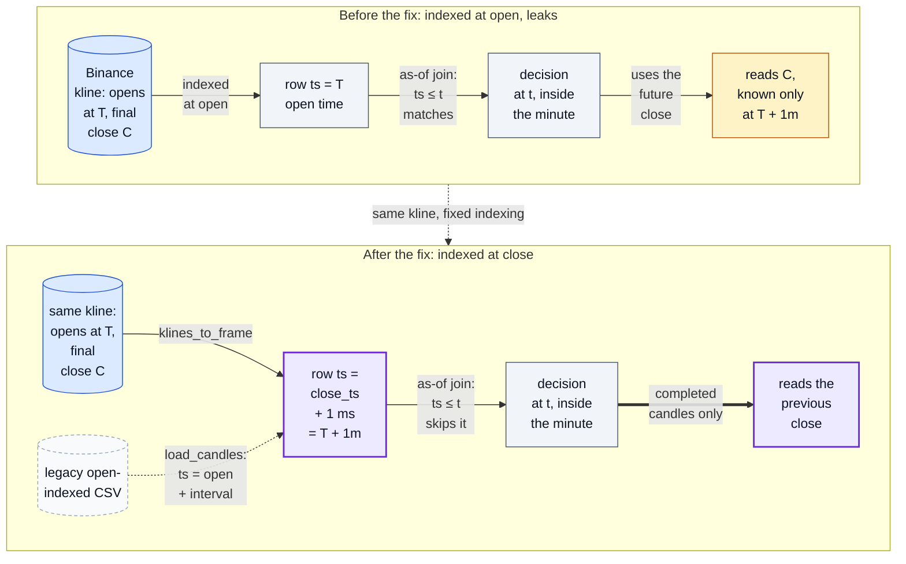

# Polymarket Bitcoin 5-Minute Backtester: Point-in-Time Walk-Forward Research

[](https://github.com/oscar-chw/Polymarket-Crypto-5min/actions/workflows/quality.yml)

Research-only Python tooling for point-in-time, walk-forward backtests of Polymarket's Bitcoin five-minute Up/Down markets; it downloads public data and simulates strategies but never places orders.
It caught and fixed a look-ahead leak: Binance one-minute candles were indexed at their open time while carrying their final close, which [invalidated an earlier positive backtest](docs/EXIT_AWARE_RESEARCH_PLAN.md#2026-07-07-result--withdrawn-after-the-availability-safe-rerun).
The corrected run selects among 512 entry rules × 192 exit policies over 26 chronological walk-forward folds, calibrating each test fold only on earlier markets; its out-of-sample metrics and limits are under [Results](#results).

Public data flows through close-indexed candles and point-in-time features into a walk-forward run whose every test fold is calibrated and selected on earlier markets only; nothing leaves the machine as an order. All four diagrams are in [docs/DIAGRAMS.md](docs/DIAGRAMS.md).



Where in the code: `polymarket_crypto_5min/clients.py` (`klines_to_frame`), `polymarket_crypto_5min/downloader.py`, `polymarket_crypto_5min/features.py` (`build_training_frame`, `asof_candle`), `polymarket_crypto_5min/walk_forward.py`, `polymarket_crypto_5min/exit_backtest.py`, `polymarket_crypto_5min/metrics.py`, `scripts/exit_aware_walk_forward.py`.

## Why this exists

A backtest of five-minute markets is only as honest as its clock: a feature that is known a minute late, or a
calibration that has seen the test fold, turns a losing rule into a winning one. This project builds the backtest so
that every feature, calibration and rule choice can be checked against the time it was actually available.

## Approach

- `clients.py` and `downloader.py` retrieve public Gamma market metadata, CLOB price histories, Data API trades, and Binance `BTCUSDT` one-minute candles with bounded retries.
- `features.py` joins each decision to only already-available candle closes, uses settled Polymarket outcomes as labels, excludes unresolved markets, and does not use terminal Gamma prices unless explicitly enabled for diagnostics.
- `walk_forward.py` expands UP/DOWN candidates, estimates prior-only empirical calibration, selects a rule on preceding markets, and evaluates the next non-overlapping chronological fold.
- `exit_backtest.py` evaluates take-profit, target-price, stop-loss, and maximum-hold policies with taker-like fees charged on entry and simulated early exit.
- `metrics.py` and the runner scripts emit trade logs, fold reports, realized equity/drawdown metrics, source hashes, configuration, and leakage checks.

Final OHLCV values are indexed at the first timestamp when the exchange candle is complete, not at candle open. That conservative clock is propagated through as-of feature joins, and each test fold is calibrated only from markets that ended earlier. The tradeoff is fewer usable observations and a worse reported result, but the result is auditable without consuming future prices or test-fold outcomes.

The same one-minute candle, indexed two ways: at its open time an as-of join inside that minute reads a close that does not exist yet; at its close-availability time the join falls back to the previous candle.



A legacy open-indexed CSV, one without `timestamp_semantics`, is shifted the same way. Every feature row is then
checked: `feature_available_at` must be at or before the snapshot, or `build_training_frame` raises `ValueError` and the run stops (the overview's gate).

Where in the code: `polymarket_crypto_5min/clients.py` (`klines_to_frame`), `polymarket_crypto_5min/features.py` (`load_candles`, `asof_candle`, the availability check in `build_training_frame`); test: `tests/test_research_invariants.py::test_ohlcv_close_is_unavailable_until_after_exchange_close_time`.

Markets are ordered by end time; each fold trains on every earlier market and tests on the next block
([fold timeline](docs/DIAGRAMS.md#3-walk-forward-fold-timeline)); correctness rules are in [docs/backtesting.md](docs/backtesting.md).

## Results

**Status label:** selected chronological walk-forward OOS on public data; trial-exposed, modeled historical; not live, cash, or executable proof.

| What | Result | Evidence |
|---|---|---|
| Look-ahead leak | found and fixed; the earlier positive $52.74 OOS result (58 trades) is withdrawn | [research plan](docs/EXIT_AWARE_RESEARCH_PLAN.md#2026-07-07-result--withdrawn-after-the-availability-safe-rerun) |
| Selected OOS trades | 16 over 26 folds, 12 profitable | [docs/results.md](docs/results.md) |
| Net PnL | −$12.31 on $160 staked (−7.7% on stake; −0.62% on $2,000 capital) | [docs/results.md](docs/results.md) |
| Max realized drawdown | −$34.03 (−1.69%) | [docs/results.md](docs/results.md) |
| Profit factor; Sharpe per trade / daily | 0.69; −0.14 / −7.57 | [docs/results.md](docs/results.md) |
| PBO, deflated Sharpe | unavailable: the policy-by-time return matrix was not retained | [docs/results.md](docs/results.md) |
| Offline tests | 27 pass, including the no-look-ahead and chronological-fold invariants | [tests/](tests/) |

The availability-safe selected result is negative. Metrics come from a local generated artifact excluded from Git; its
hash, the run manifest and the equity chart are in [docs/results.md](docs/results.md).

## Quick start

```bash
git clone https://github.com/oscar-chw/Polymarket-Crypto-5min.git && cd Polymarket-Crypto-5min
uv sync --python 3.12 --extra dev --frozen
uv run pytest -q                                          # expect: 27 passed
uv run python scripts/download_history.py --max-pages 2   # bounded public-data API-shape check
uv run python scripts/run_btc_5m_full_history_walk_forward.py --initial-capital 2000 --stake 10 \
  --train-markets 400 --test-markets 100 --price-source both   # full download, base walk-forward
uv run python scripts/exit_aware_walk_forward.py --initial-capital 2000 --stake 10 \
  --train-markets 400 --test-markets 100 --out-dir data/processed/exit_aware_walk_forward
```

The last two steps download full public history. PowerShell steps are in [docs/running.md](docs/running.md).

## Project structure

```text
polymarket_crypto_5min/   the library: public-API clients and downloader, as-of features, settled labels,
                          walk-forward calibration and selection, exit-aware backtest, metrics
scripts/                  runners: download_history, walk_forward_backtest, run_btc_5m_full_history_walk_forward,
                          exit_aware_walk_forward; threshold smoke test, horizon diagnostics, dry-run signal
tests/                    offline tests, including research invariants (no look-ahead, chronological folds)
docs/                     results and evidence, diagrams, backtest rules, research plan, history
.github/workflows/        quality (lint, types, tests); bounded and full walk-forward runs
pyproject.toml, uv.lock   package and pinned dependencies
```

Docs: see [docs/README.md](docs/README.md).

## Limits

- No order signing, order placement, wallet/account integration, live fills, queue position, cancellation logic, executable depth, or production latency evidence is present.
- Raw and generated datasets are intentionally ignored. The committed plot is a static derivative, not the underlying run artifact; reacquire public inputs and compare hashes before claiming reproduction.
- 15 of the 16 selected trades in the cited run had no post-entry price path, materially limiting exit-policy evidence.
- Drawdown is realized event-step drawdown, not mark-to-market drawdown from order-book snapshots during open positions.
- Rule/policy selection is trial-exposed; without the retained policy-by-time matrix, PBO and deflated Sharpe cannot be reconstructed.

## Lessons

- Index a value at the moment it becomes available, not the moment it describes: a candle indexed at its open carried its final close into the past and made a losing strategy look positive.
- "Leakage checks passed" only covers the leaks the check tests; the fold-order check did not test source availability.
- A conservative clock costs usable observations and gives a worse reported result, but one that can be audited.
- Keep the full policy-by-time return matrix: without it, PBO and deflated Sharpe cannot be computed afterwards.

## Credits and licence

- Data: Polymarket's public Gamma, CLOB and Data APIs and Binance public `BTCUSDT` klines; the APIs and downloaded market data remain subject to their providers' terms.
- Licence: MIT ([LICENSE](LICENSE)).

Implemented with AI coding agents under Oscar's design and review.
