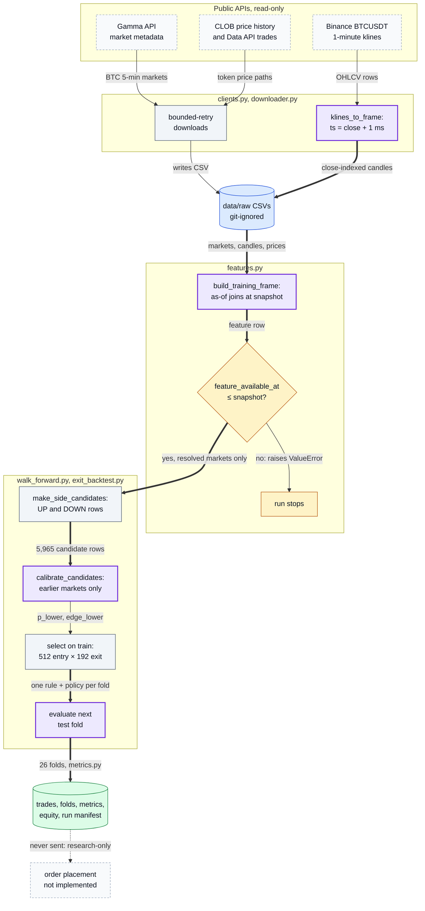
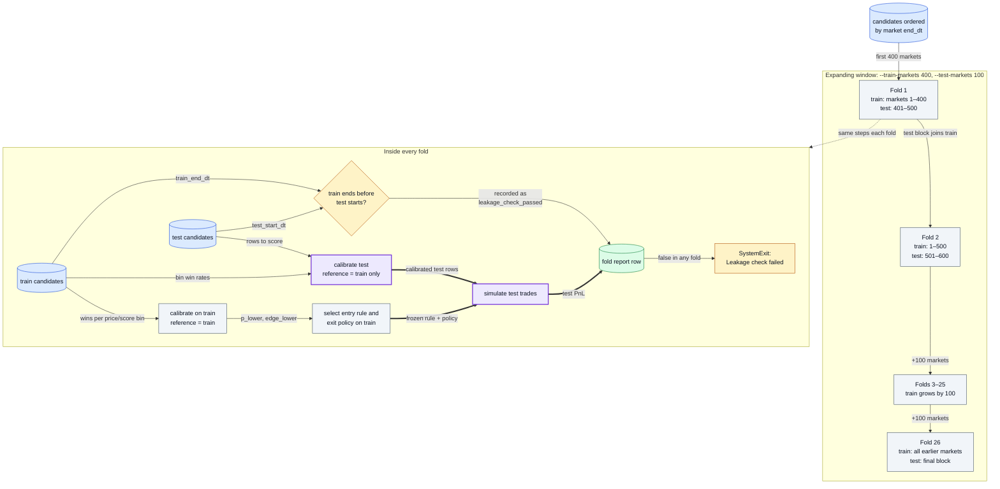
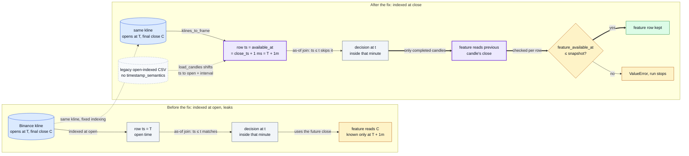

# Polymarket Bitcoin 5-Minute Backtester: Point-in-Time Walk-Forward Research

Research-only Python tooling for point-in-time, walk-forward backtests of Polymarket's Bitcoin five-minute Up/Down markets; it downloads public data and simulates strategies but never places orders.
It caught and fixed a look-ahead leak: Binance one-minute candles were indexed at their open time while carrying their final close, which [invalidated an earlier positive backtest](docs/EXIT_AWARE_RESEARCH_PLAN.md#2026-07-07-result--withdrawn-after-the-availability-safe-rerun).
The corrected run selects among 512 entry rules × 192 exit policies over 26 chronological walk-forward folds, calibrating each test fold only on earlier markets; its out-of-sample metrics and limits are under [Results](#results).
Quick check: `uv sync --python 3.12 --extra dev --frozen && uv run pytest -q` (full steps in [Run it](#run-it)).

Implemented with AI coding agents under Oscar's design and review.

Public data flows through close-indexed candles and point-in-time features into a walk-forward run whose every test fold is calibrated and selected on earlier markets only; nothing leaves the machine as an order. All four diagrams, with their sources, are in [docs/DIAGRAMS.md](docs/DIAGRAMS.md).



Where in the code: `polymarket_crypto_5min/clients.py` (`klines_to_frame`), `polymarket_crypto_5min/downloader.py`, `polymarket_crypto_5min/features.py` (`build_training_frame`, `asof_candle`), `polymarket_crypto_5min/walk_forward.py`, `polymarket_crypto_5min/exit_backtest.py`, `polymarket_crypto_5min/metrics.py`, `scripts/exit_aware_walk_forward.py`.

## Results

**Status label:** selected chronological walk-forward OOS; trial-exposed, modeled historical; not live, cash, or executable proof.

The availability-safe selected result is negative. The `ALL` row of the run's metrics file (`data/processed/exit_aware_walk_forward_availability_safe_grid/exit_aware_metrics.csv:2`, a local generated artifact excluded from Git; hash under [Provenance](#provenance)) records, rounded:

| Metric | Value |
|---|---|
| Selected trades / profitable | 16 / 12 (75% win rate) |
| Net PnL | -$12.31 on $160 staked (-7.7% on stake) |
| Return on $2,000 initial capital | -0.62% |
| Max realized drawdown | -$34.03 (-1.69%) |
| Profit factor | 0.69 |
| Sharpe (per trade / daily) | -0.14 / -7.57 |

The corresponding manifest records final Binance OHLCV at candle-close availability, calibration of each test fold from preceding training markets only, exclusion of unresolved markets and post-resolution Gamma prices from features by default, and selection exposed across `512` entry rules and `192` exit policies. PBO and deflated Sharpe are unavailable because the full policy-by-time return matrix was not retained.

The earlier positive `$52.74` OOS figure (58 trades) in [docs/EXIT_AWARE_RESEARCH_PLAN.md](docs/EXIT_AWARE_RESEARCH_PLAN.md) predates the candle-availability correction and is withdrawn: it joined final candle values at the candle-open timestamp, before they were available.


The chart is derived from the ignored local artifact `data/processed/exit_aware_walk_forward_availability_safe_grid/exit_aware_equity_curve.csv` (SHA-256 `88a89e7575bc8a65ead09167d7eb428c46daa7d91b585af2b9c42e2a9cf82d1b`) and is labeled modeled historical OOS, trial-exposed, and non-executable.

## Architecture

- `clients.py` and `downloader.py` retrieve public Gamma market metadata, CLOB price histories, Data API trades, and Binance `BTCUSDT` one-minute candles with bounded retries.
- `features.py` joins each decision to only already-available candle closes, uses settled Polymarket outcomes as labels, excludes unresolved markets, and does not use terminal Gamma prices unless explicitly enabled for diagnostics.
- `walk_forward.py` expands UP/DOWN candidates, estimates prior-only empirical calibration, selects a rule on preceding markets, and evaluates the next non-overlapping chronological fold.
- `exit_backtest.py` evaluates take-profit, target-price, stop-loss, and maximum-hold policies with taker-like fees charged on entry and simulated early exit.
- `metrics.py` and the runner scripts emit trade logs, fold reports, realized equity/drawdown metrics, source hashes, configuration, and leakage checks.

Markets are ordered by end time; each fold trains on every earlier market and tests on the next block, so the test block becomes training data only for the folds after it. The exit-aware path of a single trade is drawn in [docs/DIAGRAMS.md](docs/DIAGRAMS.md#4-exit-aware-backtest-of-one-trade).



Where in the code: `polymarket_crypto_5min/exit_backtest.py` (`walk_forward_exit_backtest`, `select_entry_exit_rules_from_training`), `polymarket_crypto_5min/walk_forward.py` (`calibrate_candidates`, `walk_forward_backtest`), `scripts/exit_aware_walk_forward.py` (the leakage exit); tests: `tests/test_research_invariants.py::test_walk_forward_test_calibration_uses_preceding_markets_only`, `::test_walk_forward_uses_expanding_nonoverlapping_test_boundaries`.

## The interesting decision

Final OHLCV values are indexed at the first timestamp when the exchange candle is complete, not at candle open. That conservative clock is propagated through as-of feature joins, and each test fold is calibrated only from markets that ended earlier. The tradeoff is fewer usable observations and a worse reported result, but the result is auditable without consuming future prices or test-fold outcomes.

The same one-minute candle, indexed two ways: at its open time an as-of join inside that minute reads a close that does not exist yet; at its close-availability time the join falls back to the previous candle.



Where in the code: `polymarket_crypto_5min/clients.py` (`klines_to_frame`), `polymarket_crypto_5min/features.py` (`load_candles`, `asof_candle`, the availability check in `build_training_frame`); test: `tests/test_research_invariants.py::test_ohlcv_close_is_unavailable_until_after_exchange_close_time`.

## Provenance

- Repository history starts at commit `0543dfdc5ef21612aaede78c55a14bbd98ea538d` on `2026-07-05T22:02:23+08:00`.
- The negative metrics source is a local generated artifact intentionally excluded from Git; SHA-256: `d224a8c990fb62572a90c6ed3eef30d831dd00a29dfbdf291f768edbf31903cb`.
- Its run manifest SHA-256 is `2f215ac951821d34a61bdab0a8c1a61f6e938c306a5e6019067e63153d3b9edd`; it records `3,000` feature rows, `5,965` candidate rows, `26` folds, `16` selected trades, and passing feature-availability and chronological-leakage gates.
- Manifest input hashes: markets `d14b8aeda6b457372616d6395b0accb2d5da259b099f3d1ef587d19f338e1f2b`, Binance candles `a740cb1dfaba38bb39f5d42d0862d43ab8ff7c0a2f3595d3ad0d9399eca25778`, and combined Polymarket prices `fcc590c19fb8b0e094b4e33e34b4c8dfeaa96a7fbfca3dc9d019ab1c23a3d525`.
- Project code is MIT-licensed; the public APIs and downloaded market data remain subject to their providers' terms.

## Run it

```powershell
git clone https://github.com/oscar-chw/Polymarket-Crypto-5min.git
cd Polymarket-Crypto-5min
uv sync --python 3.12 --extra dev --frozen
uv run pytest -q

# Bounded public-data download for an API-shape check.
uv run python scripts/download_history.py --max-pages 2

# Full public-data acquisition and chronological base walk-forward.
uv run python scripts/run_btc_5m_full_history_walk_forward.py `
  --initial-capital 2000 `
  --stake 10 `
  --train-markets 400 `
  --test-markets 100 `
  --price-source both

# Exit-aware run reusing the full-history inputs.
uv run python scripts/exit_aware_walk_forward.py `
  --initial-capital 2000 `
  --stake 10 `
  --train-markets 400 `
  --test-markets 100 `
  --out-dir data/processed/exit_aware_walk_forward
```

## Limitations

- No order signing, order placement, wallet/account integration, live fills, queue position, cancellation logic, executable depth, or production latency evidence is present.
- Raw and generated datasets are intentionally ignored. The committed plot is a static derivative, not the underlying run artifact; reacquire public inputs and compare hashes before claiming reproduction.
- `15` of the `16` selected trades in the cited run had no post-entry price path, materially limiting exit-policy evidence.
- Drawdown is realized event-step drawdown, not mark-to-market drawdown from order-book snapshots during open positions.
- Rule/policy selection is trial-exposed; without the retained policy-by-time matrix, PBO and deflated Sharpe cannot be reconstructed.
