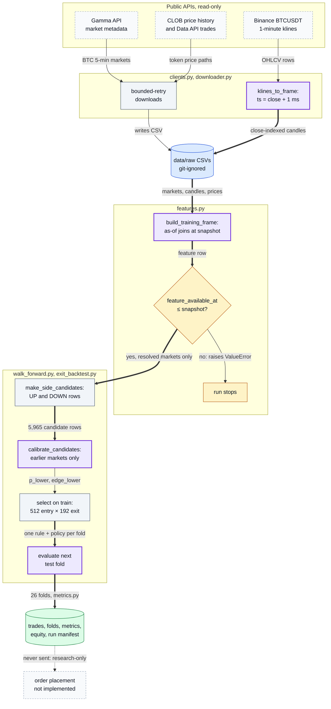
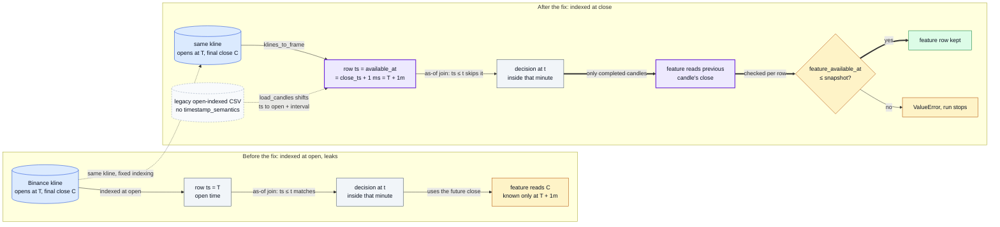
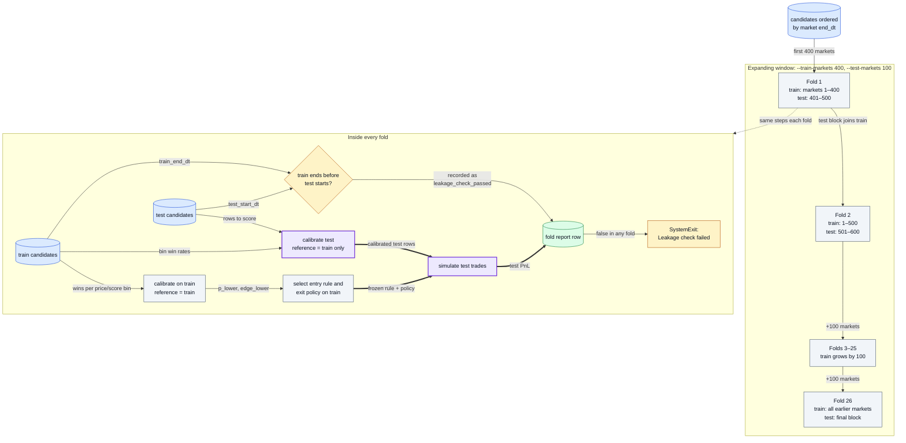
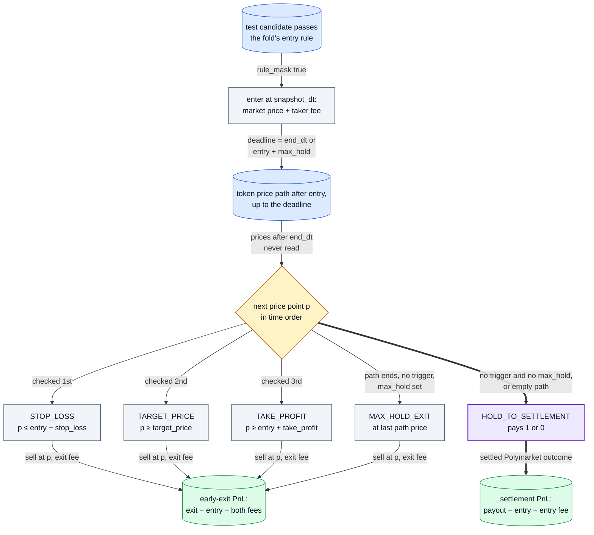

# Diagrams

1. [System overview](#1-system-overview)
2. [The candle-timing leak, before and after the fix](#2-the-candle-timing-leak-before-and-after-the-fix)
3. [Walk-forward fold timeline](#3-walk-forward-fold-timeline)
4. [Exit-aware backtest of one trade](#4-exit-aware-backtest-of-one-trade)

If a diagram and the code disagree, the code wins.

## 1. System overview

Public data flows through close-indexed candles and point-in-time features into a walk-forward run whose every test fold is calibrated and selected on earlier markets only; nothing leaves the machine as an order.

Where in the code: `polymarket_crypto_5min/clients.py` (`klines_to_frame`), `polymarket_crypto_5min/downloader.py`, `polymarket_crypto_5min/features.py` (`build_training_frame`, `asof_candle`), `polymarket_crypto_5min/walk_forward.py`, `polymarket_crypto_5min/exit_backtest.py`, `polymarket_crypto_5min/metrics.py`, `scripts/exit_aware_walk_forward.py`.

## 2. The candle-timing leak, before and after the fix

The same one-minute candle, indexed two ways: at its open time an as-of join inside that minute reads a close that does not exist yet; at its close-availability time the join falls back to the previous candle.

Where in the code: `polymarket_crypto_5min/clients.py` (`klines_to_frame`), `polymarket_crypto_5min/features.py` (`load_candles`, `asof_candle`, the availability check in `build_training_frame`); test: `tests/test_research_invariants.py::test_ohlcv_close_is_unavailable_until_after_exchange_close_time`.

## 3. Walk-forward fold timeline

Markets are ordered by end time; each fold trains on every earlier market and tests on the next block, so the test block becomes training data only for the folds after it.

Where in the code: `polymarket_crypto_5min/exit_backtest.py` (`walk_forward_exit_backtest`, `select_entry_exit_rules_from_training`), `polymarket_crypto_5min/walk_forward.py` (`calibrate_candidates`, `walk_forward_backtest`), `scripts/exit_aware_walk_forward.py` (the leakage exit); tests: `tests/test_research_invariants.py::test_walk_forward_test_calibration_uses_preceding_markets_only`, `::test_walk_forward_uses_expanding_nonoverlapping_test_boundaries`.

## 4. Exit-aware backtest of one trade

One selected test entry, followed along its own token's price path until an exit rule fires, the hold limit runs out, or the market settles.

In the cited availability-safe run, 15 of the 16 selected trades had no post-entry price path, so they took the empty-path branch to settlement (see the [README limitations](../README.md#limitations)).

Where in the code: `polymarket_crypto_5min/exit_backtest.py` (`simulate_exit_policy`, `_simulate_one_exit`, `_slice_exit_path`, `_exit_reason`), `polymarket_crypto_5min/features.py` (`taker_fee_per_share`); test: `tests/test_research_invariants.py::test_exit_pnl_deducts_entry_and_exit_fees_and_ignores_post_resolution_prices`.
