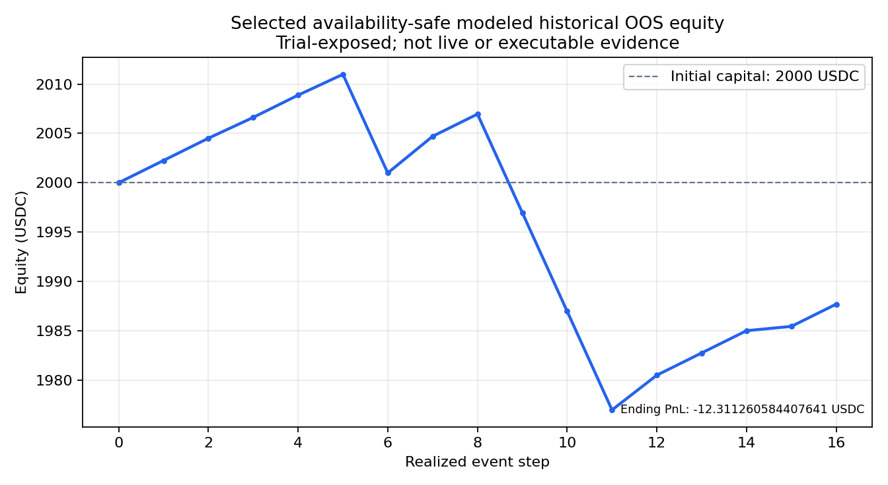

# Results: the availability-safe walk-forward and what backs it

**Status label:** selected chronological walk-forward OOS; trial-exposed, modeled historical; not live, cash, or executable proof.

The availability-safe selected result is negative. The `ALL` row of the run's metrics file (`data/processed/exit_aware_walk_forward_availability_safe_grid/exit_aware_metrics.csv:2`, a local generated artifact excluded from Git; hash under [Provenance](#provenance)) records, rounded:

| Metric | Value |
|---|---|
| Selected trades / profitable | 16 / 12 (75% win rate) |
| Net PnL | -$12.31 on $160 staked (-7.7% on stake) |
| Return on $2,000 initial capital | -0.62% |
| Max realized drawdown | -$34.03 (-1.69%) |
| Profit factor | 0.69 |
| Sharpe (per trade / daily) | -0.14 / -7.57 |

The corresponding manifest records final Binance OHLCV at candle-close availability, calibration of each test fold from preceding training markets only, exclusion of unresolved markets and post-resolution Gamma prices from features by default, and selection exposed across `512` entry rules and `192` exit policies. PBO and deflated Sharpe are unavailable because the full policy-by-time return matrix was not retained.

The earlier positive `$52.74` OOS figure (58 trades) in [EXIT_AWARE_RESEARCH_PLAN.md](EXIT_AWARE_RESEARCH_PLAN.md) predates the candle-availability correction and is withdrawn: it joined final candle values at the candle-open timestamp, before they were available.

The chart is derived from the ignored local artifact `data/processed/exit_aware_walk_forward_availability_safe_grid/exit_aware_equity_curve.csv` (SHA-256 `88a89e7575bc8a65ead09167d7eb428c46daa7d91b585af2b9c42e2a9cf82d1b`) and is labeled modeled historical OOS, trial-exposed, and non-executable.

## Provenance

- Repository history starts at commit `c8e090d9e573eb5df41f9b254d9e30ff50eca0ad` on `2026-07-05T22:02:23+08:00`.
- The negative metrics source is a local generated artifact intentionally excluded from Git; SHA-256: `d224a8c990fb62572a90c6ed3eef30d831dd00a29dfbdf291f768edbf31903cb`.
- Its run manifest SHA-256 is `2f215ac951821d34a61bdab0a8c1a61f6e938c306a5e6019067e63153d3b9edd`; it records `3,000` feature rows, `5,965` candidate rows, `26` folds, `16` selected trades, and passing feature-availability and chronological-leakage gates.
- Manifest input hashes: markets `d14b8aeda6b457372616d6395b0accb2d5da259b099f3d1ef587d19f338e1f2b`, Binance candles `a740cb1dfaba38bb39f5d42d0862d43ab8ff7c0a2f3595d3ad0d9399eca25778`, and combined Polymarket prices `fcc590c19fb8b0e094b4e33e34b4c8dfeaa96a7fbfca3dc9d019ab1c23a3d525`.
